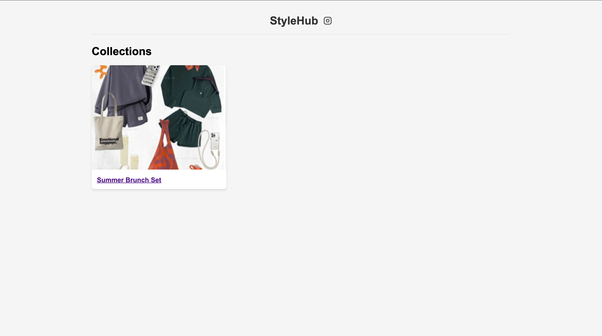
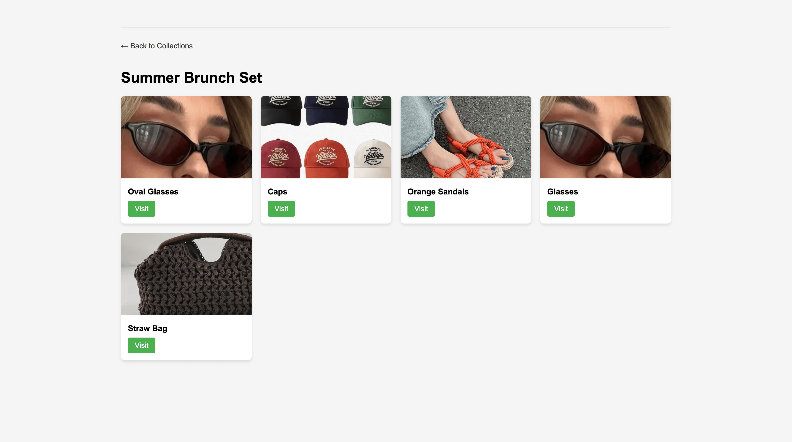

# StyleHub

StyleHub is a Django web application that lets you create and showcase collections of items with images and links. It 
can be used for promoting referral links.

## Screenshots

<p>
  
  <span>&nbsp;&nbsp;&nbsp;</span>
  
</p>

## Features

- Authentication and admin interface
- Site settings (site name, background, logo)
- Collections CRUD (title, slug, image)
- Items CRUD (title, URL, image, belongs to collection)

## Quickstart (Docker)

Requirements: Docker and Docker Compose.

1. Clone the repo
   ```bash
   git clone https://github.com/yourusername/stylehub.git
   cd stylehub
   ```

2. Configure environment
   ```bash
   cp .env.example .env
   # Optionally edit .env to change defaults (SECRET_KEY, DB creds, etc.)
   ```

3. Build and run
   ```bash
   docker compose up --build
   ```

4. Open the app
   - App: http://localhost:8000/
   - Admin: http://localhost:8000/admin/
   - Default admin credentials (configurable via env):
     - username: admin
     - password: admin

What the container does on startup (similar to Procfile):
- Applies migrations
- Ensures a default superuser exists (using SUPERUSER_* env vars)
- Collects static files
- Starts Gunicorn on :8000

## Local Development (without Docker)

1. Create virtualenv and install deps
   ```bash
   python -m venv venv
   source venv/bin/activate  # Windows: venv\\Scripts\\activate
   pip install -r requirements.txt
   ```

2. Configure environment
   ```bash
   cp .env.example .env
   # For local dev you can use Postgres or adjust settings to use your DB
   ```

3. Apply migrations and create admin
   ```bash
   python manage.py migrate
   python manage.py init_superuser
   ```

4. Run dev server
   ```bash
   python manage.py runserver
   ```

## Configuration

Environment variables (via .env or Docker Compose):
- SECRET_KEY: Django secret key
- DEBUG: True/False
- ALLOWED_HOSTS: e.g. * or example.com,api.example.com
- CSRF_TRUSTED_ORIGINS: e.g. http://localhost:8000,http://127.0.0.1:8000
- DATABASE_HOST, DATABASE_PORT, DATABASE_NAME, DATABASE_USER, DATABASE_PASSWORD
- SUPERUSER_USERNAME, SUPERUSER_PASSWORD

## Project Structure

- gallery/ — app with models, views, admin, urls
- templates/gallery/ — base.html, gallery.html, collection.html
- static/ — CSS and screenshots
- media/ — uploaded images

## Deployment

- Procfile automates: migrate → init_superuser → collectstatic → gunicorn
- Dockerfile runs the same sequence for container deployments

## Dependencies

- Django
- Pillow
- django-cleanup
- django-environ
- psycopg2
- gunicorn
- whitenoise

## License

This project is licensed under the MIT License — see the [LICENSE](LICENSE) file for details.
